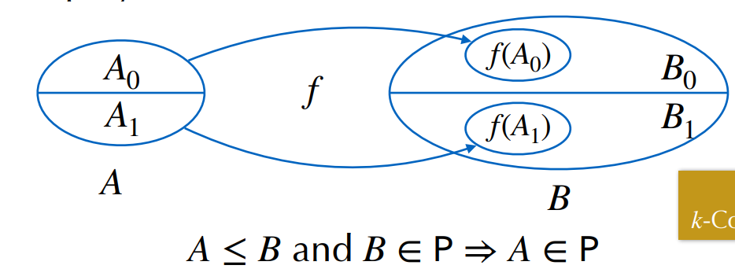

<details>
<summary><b>Lecture 1 - Introduction</b></summary>

## Binary powering
Input: $(x,n ) \in A \times \N$<br>
Output: $y \in \N : y=x^{n}$


Idea:
$$
x^{n} = \begin{cases}
1 & \text{if } n=0 \\
(x^{n/2})^{2} & \text{if } n \text{ is even} \\
(x^{n-1/2})^{2}\cdot x & \text{if } n \text{ is odd}
\end{cases}
$$

```python
def binpow(x,n):
    if n==0: return 1
    tmp=binpow(x,n//2)
    tmp*=tmp
    if n%2==0: return tmp
    else: return tmp*x
```

## Correctness
An algorithm is **correct** if:
1. It terminates
2. It computes what its specification claims

## Complexity
#### The scientific approach:
1. Experiment for various sizes
2. Model
3. Analyze
4. Validate with experiments
5. If necessary, go to 2

### Binary powering - Analysis
- Lemma: For $n \ge 1, C(n) = \lfloor log_{2}n \rfloor - 1 + \lambda(n)$ where $\lambda(n)$ is the number of 1's in the binary representation of $n$.

---
# IV. Lower bounds
## Complexity of a problem
- **Def - complexity of a problem**: that of the most efficient algorithm that solves it.

### Simple lower bounds
<center>size(Input) + size(Output) $\le$ complexity </center>

---
# V. Reductions
Problem X reduces to problem Y if there is an algorithm that solves X by solving Y.<br>

<center>Complexity of solving X = complexity of solving Y + cost of the reduction</center>

</details>


<details >
<summary><b>Lecture 2 - Divide and conquer</b></summary>

# 1. Polynomials
- Polynomials behave like integers, without carries.

#### Polynomials of Degree 1
$F= f_0+f_1T$<br> $G= g_0+g_1T$<br>
$H:= FG = h_0 + h_1T+ h_2T^2$

Naive algorithm:
$H = (f_{0}g_{0}) + (f_{0}g_{1} + f_1g_0)T + f_1g_1T^2$


## Karatsuba's Algorithm
- **Idea**: Evaluate $FG = h_0 + (\tilde h_1-h_0-h_2)T + h_2T^2$ at $T=x^k$

Algorithm: 
1. if $n$ is small, use naive multiplication
2. Let $k:= \lceil \frac{n}{2} \rceil$
3. Split $F=F_0 + x^kF_1, G= G_0+x^kG_1$ <br>
    $F_0,F_1,G_0,G_1$ of degree $<k$
4. compute **recursively** <br>
  $H_0 := F_0G_0, H_2 := F_1G_1, \tilde H_1 :=(F_0+F_1)(G_0+G_1)$
5. return $H_0+x^k(\tilde H_1 - H_0 -H_2) + x^{2k}H_2$

Complexity: $C(n) = O(n^{log_{2}3})$

---

# 2. Integers
No theorem of complexity equivalence exists, but the
algorithms over polynomials can often be adapted to integers,
with the same complexity

#### Karatsuba's Algorithm for Integers

$F$ and $G$ integers $<2^n \mapsto H:=FG$

Algorithm: 
1. if $n$ is small, use naive multiplication
2. Let $k:= \lceil \frac{n}{2} \rceil$
3. Split $F=F_0 + 2^kF_1, G= G_0+2^kG_1$ <br>
    $F_0,F_1,G_0,G_1<2^k$
4. compute **recursively** <br>
  $H_0 := F_0G_0, H_2 := F_1G_1, \tilde H_1 :=(F_0+F_1)(G_0+G_1)$
5. return $H_0+2^k(\tilde H_1 - H-0 -H_2) + 2^{2k}H_2$

---

# 3. Matrix Multiplication
- **Idea**: Split the matrices into 4 submatrices and compute the product recursively.

Input: two $n \times n$ matrices $A$,$X$ with $n=2^k$<br>
Output: $AX$

Strassen's algorithm:
1. if $n=1$, return $AX$
2. Split $A = \begin{pmatrix} a & b \\ c & d \end{pmatrix}, X = \begin{pmatrix} x & y \\ z & t \end{pmatrix}$ with $(n/2) \times (n/2)$ blocks
3. Compute recursively the $7$ products <br>
$q_1 = a(x+z), q_2 = d(y+t), q_3 = (d-a)(z-y),$ <br>
$q_4 = (b-d)(z+t), q_5 = (b-a)z, q_6 = (c-a)(x+y), q_7 = (c-d)y$
4. Return $\begin{pmatrix}
q_1+q_5 & q_2+q_3+q_4-q_5 \\
q_1 + q_3 + q_6 - q_7 & q_2 + q_7
 \end{pmatrix}$

 ## Application: Graph Transitive Closure
- **Idea**: Represent a graph as an adjacency matrix and compute the transitive closure by matrix multiplication.

Let $G = (V,E)$ be a graph with n vertices.<br>
If $A$ is the adjacency matrix of $G$, then $(A ⋁ I)^{n-1}$ is the
adjacency matrix of $G^*$<br>
The matrix $(A ⋁ I)^{n-1}$ can be computed by log n squaring
operations/multiplications 
</details>

<details >
<summary><b>Lecture 3 - Divide & Conquer 2</b></summary>

# 1. Comparing Rankings
- *Similarity metric (kendall-tau distance)*: number of inversions between two rankings

## Counting inversions
Input: An array A<br>
Output: Numbers of pairs $i<j$ such that $A[i]>A[j]$<br>
(Divide and conquer: $O(nlogn)$)

## Counting inversions: DAC 
Variation of **merge-sort**
1. assume each half is sorted
2. count inversions where A[i] and A[j] are in different halves
3. merge two sorted halves into sorted whole
**Merge-and-Count:** count inversions while merging the two sorted lists 

### Sort and Count Algorithm
```
Sort-and-Count(A):
  if A has one element
    return (0,A)

  Divide A into two halves A1,A2
  (r1,A1) <- Sort-and-Count(A1)
  (r2,A2) <- Sort-and-Count(A2)

  (rC,A) <- Merge-and-Count(A1,A2)
  return (r1+r2+rC,A)
```
```
Merge-and-Count(A1,A2):
  initialize an empty array B
  Inv <- 0

  if A1 or A2 is empty 
    return (0,nonempty list)

  Compare first elems of A1, A2
  If the smallest is in A1:
    move it at the end of B
  Else
    move it at the end of B
    Inv += |A1|

  return (Inv,B)
```

# 2. Selction: Linear Time with DAC
## Complexity of DAC algorithms
$O(log n)$: binary powering<br>
$O(n log n)$: merge sort, counting inversions<br>
$O(nlog23 ≈ n 1.58)$: Karatsuba multiplication (integers, polynomials)<br>
$O(nlog27 ≈ n 2.80)$: Strassen’s matrix multiplication<br>

## Statement of the problem
_Select:_ $(A:= \{a_1, \dots,a_n \},k) \mapsto x \in A$ s.t. $| \{a \in A| a \leq x \}| = k$

**Algorithm:** 
```
Select(A,k):
  If |A| = 1, return A[0]
  Choose a good pivot p 
  q := Partition(A,p)
  If q=k return q
  If q>k return Select(A[:q],k)
  If q<k return Select(A[q:],k-q)
```
Worst case: $C(n) \leq C(n) + O(n) \rightarrow O(n^2)$

### Selection in worst-case linear time

_Goal._ Find pivot element p that divides list of n elements into two pieces so that each piece is guaranteed to have $\leq 7/10 n$ elements.

### Median-of-medians selection algorithm
```
MOM-Select(A,k):
  n <- |A|
  if n < 50:
    return k-th smallest element of A via mergesort
  Group A into n/5 groups of 5 elements each (ignore leftovers)
  B <- median of each group of 5
  p <- MOM-Select(B,n/10)

  (L,R) <- Partition(A,p)
  if (k<|L|) return MOM-select(L,k)
  else if (k>|L|) return MOM-select(R,k-|L|)
  else return p 
```
</details>

<details>
<summary><b>Lecture 4 - Divide and conquer 3</b></summary>

## Master Theorem

Divide and conquer has a recurrence given by: 
$$C(n) \leq mC(\lceil n/p \rceil) + f(n) \text{\qquad for } n \geq p$$


> **Master Theorem - Version 1**
>
> Assume $C(n) \leq mC(n \lceil n/p \rceil)+f(n)$ if $n \geq p$,  
> with $f(n) = cn^\alpha$ ($\alpha \geq 0$). Let $q = p^\alpha$.  
> Then, as $n \to \infty$,  
> $$C(n) = \begin{cases} O(n^\alpha), &\text{if } q>m, \\ O \left(n^\alpha \log n \right), &\text{if } q = m, \\ O \left(n^{\log_p m} \right), &\text{if } q<m. \end{cases}$$
q/m governs which part of the recursion tree dominates

> **Master Theorem - More general**
>
> Assume $C(n) \leq mC(n \lceil n/p \rceil)+f(n)$ if $n \geq p$, with $f(n)$ _increasing_   
> and there exist $(q,r)$ s.t. $q \leq f(pn)/f(n) \leq r$ for large enough $n$.    
> Then, as $n \to \infty$,  
> $$C(n) = \begin{cases} O(f(n)), &\text{if } q>m, \\ O \left(f(n) \log n \right), &\text{if } q = m, \\ O \left(f(n) n^{\log_p (m/q)} \right), &\text{if } q<m. \end{cases}$$
**Note 1.** The previous theorem is a special case of this.  
**Note 2.** A tighter value of $q$ gives a better complexity bound.

# 2. Closest Pair of Points
A case when merging sub-results is not so easy
## Problem: Given points in the plane, find the closest pair.

_Naive method:_ compute all $O(n^2)$ pairwise distances, return pair with smallest one.  
_Divide and Conquer:_ split points into left and right, solve both subproblems (ok), **recombine** (hard).

**1D Approach.** Given $n$ points on a line, find the _closest_ pair 

_Solution:_ sort them in $O(n \cdot \log n)$ and traverse the list computing the distance from each point to the next.

_Sorting Solution **for 2D**:_
- sort by x-coordinate and consider nearby points
- sort by y-coordinate and consider nearby points

## Comparisons within a Strip

> Each point has to be compared with _at most 7_  
> of the next ones for the $y$-coordinate

_Def._ Let $s_i$ be the point in the 3d-strip with the $i$-th smallest y-coordinate  
_Claim._ If $|j-i|>7$, then the distance between $s_i$ and $s_j$ is _at least d_
</details>

<details>
<summary><b>Lecture 5 - Randomisation 1</b></summary>
<br>
<br>

Two types of randomisation:
1. **Las Vegas**: always correct
2. **Monte Carlo**: probabilistic correct

# 1. Toy Monte Carlo Example: Freivalds' Algorithm 
## Problem: Given $A,B,C \in \mathbb{R}^{n \times n}$, decide if $AB=C$.

**Direct approach:** Compute $D = C - AB$ and test whether $D=0$.
**Cost:** $O(n^2.38)$

Freivalds' algorithm:
```
1. Pick a random v uniformly from {0,1}^n
2. Compute w := Cv - A(Bv)
3. Return (w=0)
```

Repeating the algorithm $k$ times, the probability of error is at most $2^{-k}$.
> $Pr(\text{k errors}) \le 1/2^k$

# 2. Another Monte Carlo Example: Min-Cut in a Graph 

Given a graph $G=(V,E)$, find a cut $(S,S')$ of minimum size.

**Naive approach:** Enumerate all cuts and find the minimum one.
**Cost:** $O(2^n)$

**Randomised approach:** Pick a random cut $(S,S')$ and return it.
**Cost:** $O(n)$

Contraction algorithm [Karger'95]:
> 1. Pick a random edge $(u,v)$
> 2. Contract the edge $e$, i.e. $u$ absorbs $v$ 
>    * delete edges between $u$ and $v$ 
>    * redirect all edges incident to $v$ to $u$
> 3. Repeat until there are only two vertices left
> 4. Return the cut $(S,S')$ where $S'$ is the set of nodes absorbed by $u$

**Cost:** $O(n^4ln(n))$

Improved Contraction algorithm [Karger-Stein'96]:
> $n$ is the number of nodes
> if $n \le 6$ then, brute force enumeration
> $t = \lceil 1 + n/\sqrt{2} \rceil$
> Perform two independent runs of the contraction algorithm to obrain $H_1$ and $H_2$ each with $t$ vertices
> Recursively compute min-cuts in each $H_1$ and $H_2$
> Return the smaller of the two min-cuts

**Cost:** $O(n^2log(n))$

# 3. Randomised QuickSort

Recall: Quicstort partitioning
```python
def partition(A, l, r):
  #Runs in place
    x = A[r]
    i = l-1
    for j in range(l, r):
        if A[j] <= x:
            i += 1
            A[i], A[j] = A[j], A[i]
    A[i+1], A[r] = A[r], A[i+1]
    return i+1
```

Recall: Quicksort
```python
def quicksort(A, l, r):
    if l < r:
        q = partition(A, l, r)
        quicksort(A, l, q-1)
        quicksort(A, q+1, r)
```

**Randomised Quicksort**
```python
import random
def sort(A):
    random.shuffle(A) # Randomize the input (in O(n) ops)
    quicksort(A, 0, len(A))
```
<center>

For an **arbitrarily bad input** the **expected** number of comparisons is $\approx 2nlogn - 2.85n$

</center>


| Algorithm | Running time | In place | Extra space | Deterministic |
|:---------:|:------------:|:--------:|:-----------:|:-------------:|
| Quicksort | $O(nlogn)$   | Yes      | $logn$          | No            |
| Mergesort | $O(nlogn)$   | No       | $n$         | Yes           |


# 4. QuickSelect

```python
def select(A, k):
  random.shuffle(A)
  retrun quickselect(A, 0, len(A), k)

def quickselect(A, l, r, k):
  q = partition(A, l, r)
  if q==k: retrun A[q]
  if q<k: return quickselect(A, q+1, r, k)
  return quickselect(A, l, q-1, k)
```

Sorting gives an algorithm $O(nlogn)$ comparisons

</details>

<details>
<summary><b>Lecture 6 - Randomisation 2</b></summary>

# 1. Hash Functions

**Definition:** A hash function $h: A \rightarrow \mathbb{Z}$ is a function that maps objects form a given universe *(int, floats, strings, files etc.)* to integers.

Applications:
- Hash tables: This lecture
- Fingerprinting: check that a file ahs not been corrupted / modified; detect duplicate data; avoid backup of unchanged portions of a file; search pattern in a text (next tutorial)

# 2. Hash Tables
**Collisions do occur!** Hash tables need to detect and handle them.

**Time for insertion**: 
* m = table size
* n = number of elements

When $\alpha = n/m < 1 \text{, } \mathbb{E}( \text{nº probes}) = O(1)$


## Simple dictionaries via Hash Tables with Separate Chaining
**Def - Separate chaining:** Each table entry is a linked list of key-value pairs.

When collision occurs with separate chaining, the new element is added to the end of the list.

```python
def FindInList(key,L):
  for i, (k,v) in enumerate(L):
    if k == key: return i
    return -1

def FindInTable(key,T):
  L = T[hash(key)]
  return L, FindInList(key,L)
```
## Simple dictionaries via Hash tables with Linear Probing

**Def - Linear probing:**: Each table entry is either empty or contains a key-value pair. If a collision occurs, the next empty entry is used.

```python
def FindInTable(key,T):
  v = hash(key)
  while T[v] != None and T[v][0] != key:
    v = (v+1) % m
  return v
```

# 3. Application to Sparse Matrices
**Def - Sparse matrix:** a matrix with many zero entries.
**Ex.** Adjacency matrix of the graph of the web

**Data-structure:** array of dictionaries, where only the nonzero entries are stored

</details>

<details> 
<summary><b>Lecture 7 - Randomisation 3</b></summary>

# 1. Random walk in a maze

## Probabilistic Algorithm
**Input**: $u$ initial vertex, $v$ target vertex.
```
While u != v:
  Pick a random neighbor w of u
  u = w
Return
```
Random variable $X_k$ = vertex visited at $k$th step ($X_0 = u$)

## Exiting the maze
**Lemma:**  $\sum_{v|(u,v) \in G} T(v,u) = 2m - d(u)$
$\implies$ for any edge $(u,v)$, $T(v,u) \le 2m - 1$

Where $T(u,v)$ is the transition probability from $u$ to $v$.
And $m$ is the number of edges in the graph.

**Proposition 1:** $T(u,v) \le (2m-1)\Delta(u,v)$ for any edge $(u,v)$
Where $\Delta(u,v)$ is the number of edges connecting $u$ to $v$.

**Proposition 2:** Expected time to visit all nodes: $T(u,.) \le 2m(n-1)$

# 2. Satisfiability

**Def - Satisfiability:** Given a boolean formula $\phi$ in conjunctive normal form, is there a truth assignment that makes $\phi$ true?

**Example:** $\phi = (x_1 \lor x_2) \land (x_1 \lor \neg x_2) \land (\neg x_1 \lor x_2) \land (\neg x_1 \lor \neg x_2)$

**Def - Clause:** A disjunction of variables.
> $x \vee y \vee z$

**Def - Conjunctive normal form (CNF):** A conjunction of clauses.
> $(x_1 \lor x_2) \land (x_1 \lor \neg x_2)$

## k-SAT
**Def - k-SAT:** A boolean formula $\phi$ is k-SAT if every clause contains at most $k$ variables.

# 3. WalkSat
**Input:** A boolean formula $\phi$ in CNF in $n$ variables.
**Output:** an assignment or FAIL
> 1. Pick an assignemnt $B \in {0,1}^n$ uniformly at random  
> 2. Repeat N times:
>    - If the formula is satisfied, return $B$
>    - Pick a clause $C$ at random
>    - Pick a variable $x$ in $C$ at random
>    - Flip $x$ in $B$
> 3. Return FAIL

N is to be determined by the analysis.

## Analysis of Walksat when $k=2$
$$\mathbb{P}(success) \ge 1/2$$

WalkSat gives a Monte Carlo algorithm in time **$O(n^2)$**

### Analysis for Larger $k$

Same worst-case reasoning gives $\mathbb{P}(\Delta d= -1) \geq 1/k$.  
With $\Delta d$ the change in the number of unsatisfied clauses when flipping a variable.
Probability $p(d)$ of reaching $0$ starting from $d$ when $\mathbb{P}(\Delta d= -1) = 1/k$ (worst-case).

**Lemma.**
$$p(d) = (k-1)^{-d}$$  

Probability that WalkSat succeeds (with $N= \infty$):
$$\mathbb{P}(success) \geq \left(\frac{k}{2(k-1)}\right)^n$$  

### Stopping after $3n$ Steps for 3-SAT

$$\mathbb{P}(success) \geq \dfrac{(3/4)^n}{3n+1}$$


</details>


<details>
<summary><b>Lecture 8 - Amortization</b></summary>

<br>

**Def - Amortized analysis:** average the wors-case over a sequence of operations. 
**Def - Average-case:** average complexity over random inputs or random executions.

# 1. Dynamic Tables
### Tables in Low-Level Languages
```python
A = []
for i in range(N): A.append(i)
# Would have quadratic complexitiy with naive implementation
```

Increasing the size of the table requires:
&nbsp;&nbsp;&nbsp;&nbsp; Allocating a new array of memory
&nbsp;&nbsp;&nbsp;&nbsp; **copying** the old array into the new one
*Expensive!*

### Dynamic tables
**Def - Dynamic table:** a table that can grow and shrink.

They use three fields:
1. Size
2. Capacity
3. Pointer to the array

Worst-Case cost of append: $O(size)$.

### Amortized Cost of a Sequence of Append
 *For example, the amortized cost of a sequence of append operations to a list data structure is the average cost per append operation, over the entire sequence of operations.*

Sequence of capacities:
$$t_{k+1} = \lfloor \alpha(t_k+1)\rfloor, \quad t_0=0$$

$t_k+1$ describes the capacity of the table after $k$ appends.

Total cost of $N$ apped: $C_N \leq N + \sum_{t_k\leq N}t_k$

> **Thm.** Amortized cost bounded by
> $$\dfrac{C_N}{N} \leq 1+ \dfrac{\alpha}{\alpha-1}$$

### Deletion
Retrieve memory when the `size` of the table decreases
* When the size of the table decreases, it is possible to retrieve memory

Dangerous scenario:
- increase by a factor $\alpha$ when full;
- decrease by a factor $1/\alpha$ when possible.
 <sup>can be problematic because it may lead to frequent resizing of the table


_Solution:_ leave space to prepay for the next growth. 

```py
def pop(self):
  if self.size==0: raise IndexError
  res = self.table[self.size]
  self.resize(self.size-1)
  return res

def resize(self,newsize):
  if newsize> self.capacity or newsize< self.capacity/beta:
    self.realloc((int)(alpha*newsize))
  self.size = newsize
```
#### Application to Hash Tables

Hash tables with linear probing require a filling ratio (number of elements stored in the data structure to its capacity) bounded away from 1. _Implemented with dynamic tables._

Resizing the table requires to rehash all the entries.

In Python, the hash function is computed once as a 64-bit integer, and stored with the object. Only its value mod the new size is recomputed.

# 2. Union find

Abstract Data Type for *Equivalence Classes*.
Main operations:
1. Find$(p)$: identifier for the equivalence class of $p$
2. Union$(p,q)$: add the relation p $\sim$ q (Combines two subsets)

## Forests in arrays
$p[i] := parent(i)$
$[2,3,2,3,10,6,6,6,10,6,2,11]$
```
        6           3        11        2
      / | \         |                 / \
     5  7  9        1                0  10
                                        / \
                                       4   8
```

First version:
```python
def find(p,a):
  while p[a]!=a: a=p[a]
  return a

def union(p,a,b):
  link(p, find(p,a), find(p,b))

def link(p,a,b):
  p[a]=b
```

Worst case:
```python	
for i in range(N): union(p,0,i)
# Uses O(N^2) array accesses
```

### Union by Rank
Maintain rank (=height) of each tree.
```python
def link(p,a,b):
  if a==b: return
  if rk[b]>rk[a]: p[a]=b
  else: p[b]=a
  if rk[a]==rk[b]: rk[a]+=1
```
Worst case for find: $O(\log N)$

### Path Compression
```python
def find(p,a):
  if p[a]!=a: p[a]=find(p,p[a])
  return p[a]
```
Preserves the properties of rank (becomes an upper bound on height). Worst-case for find unchanged.
<center>

 **Theorem.** A sequence of $m \ge n$ union or find operation uses $O(mlog^{\star}n)$ array accesses.
</center>

$\log^{\star}n$: number of iterations of $\log_2$ before reaching $\leq1$. 

## Link & Compress
```python
def compress(p,a,b):
  # b ancestor of a
  if a!=b:
    compress(p,p[a],b)
    p[a]=p[b]
```

1. Rewrite the sequence of m union or find as a sequence of O(m) link and compress operations.
2. Perform the links first (each O(1) operations).

**Def - T(m,n,r):** worst-case number of parent changes in $\le m$ compress in a forest of $\le n$ nodes, each of rank $\le r$.

<center>

**Lemma.** $T(m,n,r) \le nr$.
</center>


### High and Low Forests
Split into two forests:
- rank of forest in total $r$
- Choose some $s$ 
- $F_+$ with all nodes with $r \geq rank > s$ 
- $F_-$ with all nodes with $rank \leq s$

```
Compress2(a,b,F):
if rk[a]>s then Compress2(a,b,F+)
elif rk[b]<=s then Compress2(a,b,F-)
else
  x = a
  while rk[p[x]]<=s and p[x]!=x:
    x = p[x]
  Compress2(p[x],b,F+)
  Shatter(a,x,F-) # new parent in F+
  p[x] = x # counts parent change within F+
```

- $m_-$ compress purely inside $F_-$
- $m_+ := m-m_-$

$C$ sequence of $m$ compress _splits_ into  
- $m_-$ compress in $F_-$, denoted $C_-$
- $m_+$ compress in $F_+$, denoted in $C_+$
- $|F_-| \leq n$ parent changes in Shatter
- $\leq m_+$ parent changes within $F_+$

$$T(m,n,r) = T(F,C) \leq T(F_+,C_+) + T(F_-,C_-) + m_+ + n$$

### Conclusion

For any sequence $C$ of length $\leq m$ in a forest with $n$ nodes of rank $\leq r$, 
$$T(F,C)-m \leq T(F_-,C_-)-m_- + T(F_+,C_+) + n$$

Where:
- $T(F,C) -m$ has $rk \leq r$
- $T(F_-,C_-)-m_-$ has $rk\leq s$
- $T(F_+,C_+) \leq \dfrac{rn}{2^s}$

Choose $s=\log_2{r}$
$$T(F,C)-m \leq T(F_-,C_-) -m_- + 2n$$

Iterating $\log^{\star}r$ times yields 

$$T(F,C) \leq m+2n\log^{\star}{r} = O(m\log^{\star}{n}) \quad (m\geq n, r\leq n)$$

</details>


<details>
<summary><b>Lecture 9 - Balance</b></summary>

### Data-structures for Ordered Data

Priority Queues: insert, findmax, deletemax

Ordered Search Trees: insert, find, delete, selectbyrank, floor, ceiling, countbetween, ... 
<sup> (Sorting first is not an option) </sup>

**Balanced trees** allow for all these operations in *worst-case time $O(\log n)$*.

# 1. Priority Queues & Heap-ored Trees

Recall: Dijkstra's algorithm for shortest path in a graph.
```
while PQ not empty:
  remove first edge ((u,v), d(s,u)) from PQ
  if v not in the tree
    add v to the tree
  for all neighbours w of v
    insert ((v,w),d(s,v)+d(v,w)) into PQ
```

## Heaps
**Def - heap:** A heap is a tree-based data structure that satisfies the heap property: each node is either greater than or equal to (in a max heap) or less than or equal to (in a min heap) its children. 

### Basic operations


- **Insert** operation adds a new element to the heap and maintains the heap property.
- **Fixup**  moves an element up in the heap to its correct position after removal or addition to end of min heap.
> $\le \log_2{n}$ comparisons
- **Deletemax** removes the maximum element from a max heap and returns it.
- **Fixdown**  moves an element down in the heap to its correct position after insertion or root removal from a max heap.
> $\le 2\log_2{n}$ comparisons

# 2. Binary Search Trees
**Def - Binary Search Tree:** A binary search tree is a binary tree in which each node has a key and satisfies the binary search tree property: the key in each node is greater than all keys stored in the left subtree, and less than all keys in the right subtree.

Worst-case for *Find/Insert*: $O(n)$

### Average-Case analysis

Internal path length:
- $P_n :=$ sum depth of all nodes
- $P_n/n +1:$ average successful search
- $P_n/n +3:$ average unsuccessful search (=insert)


<center>

**Prop:** In a BST built from $n$ random keys, the average number of comparisons for a search is $1.39\log_2{n} + O(1)$
</center>


### Select
median, select:
change nodes into key,left,right,size

> The select operation is used to find the node with a specific rank (position) in the tree. To do this, we can add additional information to each node in the form of a "size" field, which represents the number of nodes in the subtree rooted at that node.
```py
def _insert(self,node,key):
  if node is None: return Node(key)
  if node.key > key:
    node.left = self._insert(node.left,key)
  elif node.key < key:
    node.right = self._insert(node.right,key)
  node.size = 1 + size(node.left) + size(node.right) # !!!!!!!!!!!!!!!!!!!!!!!!!!!!!!!!!!!!
  return node
```
</details>

<details>
<summary><b>Lecture 10 - Balancing with B-trees</b></summary>

# 3. Red-Black BST

**Def - 2-3 search trees:** Self-balancing data structure used to maintain a sorted list while allowing efficient insertion and deletion. Each node can have two keys (2-node) or three keys (3-node).

### (Left-leaning) Red-Black BST
**Properties:**
- Red links lean left
- No node has two red links connected to it
- Perfect black balance: every path from root to null link has the same number of black links
```
       B (30)
      /       \
    R (20)     B (40)
   /   \         /      \
 B (10) R (30)  B (40) B (50)
```

### Insertion
1. Insert as usual
2. Color new node red
3. Rotate right if right child is red and left child is black
4. Rotate left if left child is red and left grandchild is red
5. Flip colors if both children are red

- **Right rotation:** move left child to root, original root becomes right child, original right child becomes left child of new root
- **Left rotation:** move right child to root, original root becomes left child, original left child becomes right child of new root

#### Worst-Case analysis
<center>

>**Prop:** The height of a red-black BST with $n$ nodes is at most $2\log_2{n}$ 
</center>

# 1. B-Trees

**Def - B-tree:** 
1. The root is either a leaf or has between 2 and $t$ children.
2. Non-leaf nodes (except the root) have between $\lceil t/2 \rceil$ and $t$ children.
3. All leaves are at the same depth. Each leaf stores between $\lceil t/2 \rceil$ and $t$ items.

### B-Trees: Find
For a B-tree of order t:
- each internal node has up to t-1 keys to search 
- each internal node has between $\lceil t/2 \rceil$ and t children
- depth of B-tree storing N items: $O(\log_{\lceil t/2 \rceil}{N})$

Complexity:
- $O(\log_{2}{t})$ to binary search with branch to take at a node
- Total time to ifnd item: $O(log_2N)$

### Insertion
**Insert x (similar to 2-3 search trees):** Do a find on x and find appropriate leaf node
- if leaf node is not full, fill in empty slot with x
- if leaf node is full (has t items):
  - split into two nodes with $\lfloor (t+1)/2 \rfloor$ and $\lceil (t+1)/2 \rceil$ children
  - adjust parents up to the root node

Tree in internal memory: $t=3$ or $4$  
Tree on disk: $t=32$ to $256$ (inferior and leaf nodes fit on 1 disk block)
  - depth = 2 or 3 -> fast access to databases

</center>
</details>

<details>
<summary><b>Lecture 11 - String alorithms 1</b></summary>

### Substring search

**Input:** two strings (text $T$ and pattern $P$)
**Output:** answer to "is $P$ a substring of $T$?" 
$substring := \exists i, \forall j \in \{0,...,m-1\}, T_{i+j} = P_j$


Known algorithms ($|T|=n; |P|=m$):  
||worst case|average case|  
|---:|---|---|  
|Brute force|$\leq nm$|$\leq 2(n-m+1)$|  
|Knuth-Morris-Pratt|$\leq n+m$|$\geq n$|  
|Boyer-Moore|$\leq 3n$|$\approx n/m$|  

# 1. Brute force
```py	
def bruteforce(text,pattern):
  for i in range(len(text) - len(pattern)):
    for j in range(len(pattern)):
      if text[iç+j] != pattern[j]: break
      else:
        return i
  return -1
```  
- Worst-case: $P=a^{m-1}b, t=a^{n-1}b \implies$ $O((n-m+1)m)$

**Expected Number of Comparisons for All Matches**  
Fixed pattern, uniform random text  

|# of texts of length $n$ having...|| 
|---|---|  
|at least the $k$ first letters of the pattern at a given location|$$R^{n-k}$$|  
|exactly the k first letters of the pattern at a fiven location|$$R^{n-k}-R^{n-k-1}$$|
|# of comparisons at this location|$$\sum_{k=0}^m (k+1)(R^{n-k}-R^{n-k-1}) \leq \dfrac{R^n}{1-1/R}$$|  
|# of comparisons at all locations:|$$\leq \frac{(n-m+1)R^n}{1-1/R}$$|  

_Expectation_ $\leq \dfrac{n-m+1}{1-1/R}$.

# 2. Knuth-Morris-Pratt
```py
def kmp(text,dfa):
  m=len(dfa)
  s=0
  for i in range(len(text)):
    s=dfa[s].get([text[i]],0)
    if s==m: return i-m+1
  return -1
```

**Def - Deterministic Finite Automaton (DFA):** 
- a finite set $Q$ of states
- a transition function $\delta: Q \times \Sigma \rightarrow Q$
- an initial state $q_0 \in Q$
- a set of accept states $F \subseteq Q$
> mathematical model used to recognize patterns within input.
>> The DFA operates by reading input symbols one at a time and transitioning between states based on the current input symbol and the transition function. The transition function specifies which state the DFA should move to based on the current state and the input symbol.

When a match fails at index $i$ in the pattern, $i-1$ characters of the text are known $\longrightarrow$ imagine starting over from the 2nd one.  

```py
def preprocess(pattern):
  m=len(pattern)
  # dfa[state][key] gives new state
  dfa=[{} for i in range(m)]
  dfa[0][pattern[0]]=1
  state = 0

  for i in range(1,m):
    for key in dfa[state]: dfa[i][key] = dfa[state][key]
    state = dfa[state].get(pattern[i],0)
    dfa[i][pattern[i]] = i+1
```


# 3. Boyer-Moore
```py
# lcs - least character shift
# bms - boyer-moore shift
def bm(text,pattern, lcs,bms):
  n= len(text)
  m = len(pattern)
  i = 0
  while i<=n-m:
    for j in range(m-1,-1,-1):
      if text[i+j]!=pattern[j]:
        i+=max(1,j-lcs.get(text[i+1],-1),bms[j])
        break
    else: return i
  return -1

def lastoccurence(pattern):
  m = len(pattern)
  lcs = {}
  for i in range(m-1):
    lcs[pattern[i]] = i
  return lcs
```
Worst-case for last character heuristic: $P=ba^{m-1}, T=a^n$

Average-case complexity: $\mathbb{E}[\text{\# of comparisons}]\approx n/m$ for large $R/m$

#### Shift by Longest Suffixes

$bms[j]:= min \left \{ s > 0 | (\forall k \in \{j+1, \dots, m\}: s>k \vee P[k-s] = P[k]) \wedge (s>j \vee P[j-s]\neq P[j])   \right \}$


Corresponding code:

```py 
def longestsuffix(pattern):
  m=len(pattern)
  ls=[0]*(m-1)
  for i in range(m-1,-1,-1):
    for j in range(i+1):
      if pattern[m-1-j] == pattern[i-j]:
        ls[i] += 1
      else: break
  return ls

def bmshift(pattern):
  ls = longestsuffix(pattern)
  m = len(pattern)
  bms = [m]*m
  j = 0
  for i in range(m-2,-1,-1):
    if ls[i]==i+1:
      for j in range(j,m-i,-1): bms[j]=m-1-i
  for i in range(m-1):
    bms[m-1-ls[i]] = m-1-i
  return bms
```

</details>


<details>
<summary><b>Lecture 12 - String algorithms 2</b></summary>

# 1. Tries (digital search trees) 
- **Trie (prefix tree)** is a tree-like data structure for storing a set of strings
- Each node represents a single character in a string
- Root node represents empty string, children of root node represent first characters of strings in set, children of these nodes represent second characters of strings in set, and so on

```py
class Node:
  def __init__(self, sizeAlpha, val=None):
    self.val = val # None except at end of string
    self.child = [None]*sizeAlpha # sizeAlpha = size of alphabet

class Trie:
  def __init__(self, sizeAlpha):
    self.root = Node(sizeAlpha)
    self.sizeAlpha = sizeAlpha
  def insert(self,str,val,idnex=0):
    self.root=self._insert(self.root,str,val,index)
  def find(self,str,index=0):
    return self._find(self.root,str,index)
  def longestprefix(self,str,index=0):
    return self._longestprefix(self.root,str,index)
```

### Find/Insert/LongestPrefix
> Worst-case time *linear* in length of string (optimal)

```py
def _find(self,node,str,index):
  if node is None: return None
  if index==len(str): return node.val
  return self._find(node.child[ord(str[index])],str,index+1)

def _insert(self,node,str,val,index):
  if node is None: node = Node(self.sizeAlpha)
  if index==len(str): node.val = val
  else:
    node.child[ord(str[index])] = self._insert(node.child[ord(str[index])],str,val,index+1)
  return node

def _longestprefix(self,node,str,index):
  if node is None: return -1
  if index==len(str): return 0 
  return 1 + self._longestprefix(node.child[ord(str[index])],str,index+1)
```
$$R \times \text{num. strings} \le \text{size(trie)} \le R \times \text{num. strings} \times \text{average string length}$$


### Ternary Search Tries (TST)
Differ to DST in how they store the strings in the trie.
- The path from the root of the trie to a leaf node represents a complete string
- Each node has three pointers: left, right, and middle
- The left and right pointers are used to store characters that are lexicographically smaller or larger than the character stored at the current node
- The middle pointer is used to store characters that are equal to the character stored at the current node


# 2. Lempel-Ziv-Welch (LZW) compression
- It works by replacing repeating patterns of data with references to dictionary entries that represent the patterns
- The algorithm operates in two phases: encoding and decoding
- During encoding, the algorithm constructs a dictionary of patterns and replaces each pattern with a unique code
- During decoding, the algorithm uses the dictionary to reconstruct the original data by replacing codes with the corresponding patterns
### Create a code with longer and longer prefixes
Example: `abracadabracadabracadabra`
1. Split into reocurring patterns: `a|b|r|a|c|a|d|ab|ra|ca|da|br|ac|ac|ad|abr|a`
2. Create a dictionary: `a:0, b:1, r:2, c:3, d:4, ab:5, ra:6, ca:7, da:8, br:9, ac:10, ad:11, abr:12`
3. Profit! $\implies$ 25 characters $\in \sum$ input **vs** 16 characters $\in \mathbb{N}$ on output

### Resulting Code
```python
def getnext(str,index):
  res = str[index]
  for i in range(1, _SIZE): res=res*256+str[index+i]
  return res

def uncompress(inname,outname):
  dic = [chr(i) for i in range(256)]
  count = _MAXASCII
  with open(inname,"rb") as f_in,\
    open(outname,"wb", encoding="ascii") as f_out:
    text = f_in.read() #Make it a long string
    val = dic[getnext(text,0)]
    for index in range(_SIZE, len(text),_SIZE):
      f_out.write(val)
      new = dic[getnext(text,index)]
      if new is None: new = val+val[0]
      elif new==_MAXASCII: break
      if count<_MAXCODE:
        count += 1
        dic[count] = val+new[0]
      val = new
```

# 3. Huffman Encoding
Huffman encoding is a data compression algorithm that assigns shorter codes to more frequent characters and longer codes to less frequent characters, resulting in a compressed version of the data that uses fewer bits. It builds a binary tree using character frequencies and uses the tree to assign codes, with 0 representing a left branch and 1 representing a right branch.

#### Example:
- Input: `Racoons are cool`
1. Make freq table
<table><thead><tr><th>Character</th><th>Frequency</th></tr></thead><tbody><tr><td>H</td><td>1</td></tr><tr><td>u</td><td>2</td></tr><tr><td>f</td><td>4</td></tr><tr><td>m</td><td>2</td></tr><tr><td>a</td><td>4</td></tr><tr><td>n</td><td>3</td></tr><tr><td>c</td><td>3</td></tr><tr><td>o</td><td>1</td></tr><tr><td>d</td><td>2</td></tr><tr><td>i</td><td>2</td></tr><tr><td>s</td><td>2</td></tr><tr><td>l</td><td>1</td></tr><tr><td>t</td><td>1</td></tr><tr><td>e</td><td>3</td></tr><tr><td>r</td><td>1</td></tr><tr><td>g</td><td>1</td></tr><tr><td>p</td><td>1</td></tr><tr><td>y</td><td>1</td></tr><tr><td>b</td><td>1</td></tr></tbody></table>

2. Make tree based on frequencies
```
            *
           / \
          /   \
         *     *
        / \   / \
       /   \ /   \
      *     *     *
     / \   / \   / \
    /   \ /   \ /   \
   *     *     *     *
  / \   / \   / \   / \
 R   a c   o n   s space r
        / \   /     / \
       e   c l     e   c

```

3. Finally, we use the binary tree to assign codes to the characters. A 0 represents a left branch and a 1 represents a right branch. The resulting encoded data would look like this:
<table><thead><tr><th>Character</th><th>Frequency</th><th>Code</th></tr></thead><tbody><tr><td>R</td><td>1</td><td>1111</td></tr><tr><td>a</td><td>3</td><td>0000</td></tr><tr><td>c</td><td>2</td><td>0001</td></tr><tr><td>o</td><td>3</td><td>0010</td></tr><tr><td>n</td><td>2</td><td>0011</td></tr><tr><td>s</td><td>1</td><td>0100</td></tr><tr><td>space</td><td>2</td><td>0101</td></tr><tr><td>r</td><td>1</td><td>0110</td></tr><tr><td>e</td><td>1</td><td>0111</td></tr><tr><td>c</td><td>1</td><td>1000</td></tr><tr><td>l</td><td>1</td><td>1001</td></tr></tbody></table>


### Optimal Tries
**Def - Weighted external path length:** The sum of the weights of all the nodes on the path from the root to a leaf node $W(t) := \sum_{\text{leaf } l}\text{weight(l)}\times\text{depth(l)}$. Where the *weight(l)=number of occurrences*

**Observations:** there is an optimal trie such that two (sibling) leaves $l_1$ and $l_2$ of minimal weights $n_1$ and $n_2$ are at its lowest level; the trie $T^{\star}$ obtained by replacing $l_1$ and $l_2$ with a leaf $l$ of weight $n_1+n_2$ is also optimal.

### Huffman Algorithm
> **Thm:** Huffman's algorithm constructs a prefix-free code with minimal $W(T)$.

```py
class NodeHuffman:
  def __init__(self,val,child=[None,None]):
    self.val = val
    self.child = child

def maketrie(text,wordsize):
  numocc = getnumberoccurrences(text,wordsize)
  minpq = PQ() #Priority queue of trees by weights
  # Start from a forest with one tree per letter
  for c in range(2**(8*wordsize)):
    if numocc[c]>0:
      minpq.insert(-numocc[c],NodeHuffman(c))
    while minpq.size>1:
      # Comvine two trees of minimal length
      n1,l1 = minpq.deletemax()
      n2,l2 = minpq.deletemax()
      minpq.insert(n1+n2,NodeHuffman(None,[l1,l2]))
  return minpq.deletemax()[1]
```

### Communicating the Trie
Use a preorder tracversal with 0 for nodes and 1+letter for leaves. The resulting string is the code for the trie.

```py
def writetrie(trie,out):
  if trie.val is None:
    out.extend('0')
    writetrie(trie.child[0],out)
    writetrie(trie.child[1],out)
  else:
    out.extend('1')
    out.extend(format(trie.val,'08b'))

def readtrie(barray,index):
  if barray[index]:
    return NodeHuffman(int(barray[index+1:index+1])),index+9
  else:
    left, index = readtrie(barray,index+1)
    right, index = readtrie(barray,index)
    return NodeHuffman(None,[left,right]),index
```

### Summary 

Table of LZW vs Huffman in markdown:

| Name |     |
| :---:   | :---: | 
| Lempel-Ziv-Welsh | captures repetitions, regularity, easy to decode, works in one pass   | 
| Huffman | exploit differences in frequencies, requires two passes, the code must be treansmitted (possibly compressed) as well.  | 
</details>


<details>
<summary><b>Lecture 13 - P vs NP</b></summary>

### Model for Polynomial Time Computation

- **Def - computable in polynomial time:** A function from $\{0,1\}^\star$ to $\{0,1\}^\star$ is *computable in polynomial time* if $\exists k$ and a program computing the output in time $O(n^k)$ for all input of size $n$.
> The symbol $\star$ is used to denote an arbitrary number of elements, so $\{0,1\}^\star$ can be read as "the set of all finite-length sequences of elements from the set $\{0,1\}$".


- **Def - Decision problem:** one where the output is a single binary digit 
- **Def - P:** P is the class of all decision problems computable in polynomial time

# 1. The class NP (nondeterministic polynomial time)

### Verifier and certificate
- **Def - Verifier:** a program $V : \{0,1\}^\star \times \{0,1\}^\star \rightarrow \{0,1\}$ s.t. $\forall w\in\{0,1\}^\star$, $A(w) = 1 \iff \exists C \in \{0,1\}^\star, V(w,C)=1$
> takes as input a claim or statement made by some other computation, and checks to see if the claim is true or false

- **Def - NP:** the class of problems $A$ s.t $\exists$ verifier $V$ in $P$ with $|C| = poly(|w|)$

>The definition given specifies that a problem $A$ belongs to NP if there exists a verifier $V$ in $P$ (i.e., a verifier that can be solved in polynomial time) such that the size of the certificate $C$ (i.e., the additional information provided to the verifier to help it check the validity of the solution) is a polynomial function of the size of the witness $w$ (i.e., the information provided to the verifier that allows it to check the solution).
>Intuitively, this means that problems in NP are those for which a solution can be checked quickly, but it is not known whether a solution can be found efficiently. 
> |.| used to denote the size of $C$ 

- **Prop:** $P\subseteq NP$

- **Prop:** NP is at most Exponential time

### The 'N' in NP
NP is about:
- the power of determinism
- the differnce of complexity between finding and checking
- and this applies to mathematical proofs as special cases

# 2. NP complete problems
- **Def - reduces:** $A \text{\&} B$ two decision problems. A reduces to B (denoted $A \le B$), if there exists $f$ computable in polynomial time s.t. $A(x) = 1 \iff B(f(x)) = 1$



- **Def - NP Complete:** B in $NP$ is *$NP$-complete* if $\forall A \in NP, A \le B$ **OR** B is $NP$ and $NP$-hardA
> Examples of NP-complete problems include the Boolean satisfiability problem (SAT), the subset sum problem, and the knapsack problem. These problems are believed to be computationally difficult, and it is not known whether there exist efficient algorithms for solving them. However, because they are NP-complete, if an efficient algorithm were discovered for any one of these problems, it would also apply to all of the others.
- **Def - NP Hard:** A problem is NP-hard when it can be transformed into any other problem in NP using a polynomial-time reduction.(at least as hard as the hardest problems in NP)
>P-hard refers to a class of problems that are "at least as hard as the hardest problems in NP". Informally, this means that if there is a way to solve an NP-hard problem quickly (for example, in polynomial time), then all problems in NP can also be solved quickly, which would imply that P=NP.

>On the other hand, NP (nondeterministic polynomial time) is a complexity class that consists of all problems for which a solution can be verified in polynomial time by a deterministic Turing machine
- **Theo - Cook Levin:** 3-SAT is NP-complete
</details>

<details>
<summary><b>Lecture 14 - Apporimation for hard problems</b></summary>

### P, NP, NP-complete, NP-hard
Recall:
  - **P:** decision problems computable with in polynomial time
  - **NP:** decision problems with a verifier in **P**
  - $B$ in **NP** is **NP-complete** if $\forall A \in NP, A \le B$ *OR* B is **NP** and **NP-hard**
  - **Def - NP-hard:** $\forall A \in NP, A\le B$

### Decision vs. Optimization
Recall Problem SubsetSum:
  - **Def - SubsetSum:** Given a set of integers $S$ and an integer $t$, is there a subset of $S$ whose sum is $t$?
  - **Def - Decision:** Given a set of integers $S$ and an integer $t$, is there a subset of $S$ whose sum is $t$?
  - **Def - Optimization:** Given a set of integers $S$ and an integer $t$, find a subset of $S$ whose sum is as close as possible to $t$. 
  
Optimization variants:
1. Is there (A,m) s.t $\sum\limits_{i\in A} = m \le k$?
2. Maximize m s.t $\sum\limits_{i\in A} = m \le k$
3. Find corresponding A.

- **$\rho$-approximation**: finds $M$ : $M\ge \rho m_{max} (\rho<1)$
$$(M\le \rho\cdot m_{min} (\rho > 1) \text{ for a minimization problem})$$

### Approximation Schemes
$$M\ge (1-\epsilon)\cdot m_{max}$$
>  defines the approximation ratio of an algorithm, where $M$ is the value of the solution found by the algorithm, $m_{max}$ is the value of the optimal solution, and $\epsilon$ is a positive constant between 0 and 1.


- **Def - Polynomail Time Approximation Scheme (PTAS):**  runs in polynomial time for a given $\epsilon$.
- **Def - Fully Polynomial Time Approximation Scheme (FPTAS):** runs in polynomial time aslo in $1/\epsilon$
> This means that the algorithm can find a solution that is arbitrarily close to the optimal solution in polynomial time for any given value of $\epsilon$.

- NP-complete problms are not equal for approximation

# 1. Approximations for Subset-Sum

### Exact algorithm
```python
def subset_sum(X,t):
  X=sorted(X)
  n = len(X)
  S = [0]
  for i in range(n):
    S = merge(S,X[i],t)
  return S[-1]
```
- `merge(s,X[i],t)` -> $(S\cup (S\bigoplus X_i))\cap [0,t]$ in time $O(|S|)$ (works as in MergeSort)
>  It takes two sets, s and X[i], and combines them into a single set. In this case, the operation used to combine the two sets is the bitwise exclusive-or operation (denoted by ⨁) , which compares the bits of two operands and if the bits are different then the corresponding bit in the result is set to 1. And the resulting set is intersected by a range of [0,t] to get the final set.

Correctness: all subsets with sum $\le t$ are considered. 
Complexity: $O(\sum\limits_{i=1}^n |S_i|) = O(min(2^n, nt))$

### Approximation
```python
def approx_subset_sum(X,t):
  X=sorted(X)
  n = len(X)
  S = [0]
  for i in range(n):
    S = merge(S,X[i],t)
    S = filter(S, epsilon/n)
  return S[-1]

def filter(S,delta):
  res = [S[0]]
  for i in range(1,len(S)):
    if S[i] > (1+delta)*res[-1]:
      res.append(S[i])
  return res
```
- **Lemma:** For any $0<a\le b$, $\text{filter}(S,\delta)\cap[a,b]\le \log_{1+\delta}(b/a)$
> The Lemma states that for any range [a,b], the filtered set S will contain no more than log(b/a) elements
- **Thm:** This algorithm returns a $1-\epsilon$-approximation of the optimum, in time $O(\epsilon^{-1}n^3\log n:w
  )$

> The Theorem states that this algorithm returns a 1-epsilon approximation of the optimal subset sum solution, in time O(epsilon^-1n^3log(n)). The approximation ratio of 1-epsilon means that the value of the subset found by the algorithm is at most 1-epsilon times the value of the optimal subset. 

# 2. Max-SAT and its Approximation
### Max-k-SAT is NP-complete for $k\ge 2$
Problem Max-k-SAT
- **Input:** k-SAT formula $\phi$, $l\in \mathbb{N}$
- **Output:** yes $\iff \exists$  a truth assignment satisfying $\ge l$ clauses in $\phi$.

$$\text{3-SAT}\le\text{Max-3-SAT (take }l=|\phi|)\\\text{3-SAT}\le\text{Max-2-SAT}$$
> The 3-SAT problem is a well-known NP-complete problem in computer science. It is a special case of the Boolean satisfiability (SAT) problem, where the given Boolean formula is in conjunctive normal form (CNF) and each clause contains exactly 3 literals. The goal is to find an assignment of Boolean variables that makes the formula true.
>> The Max-3-SAT and Max-2-SAT problems are generalizations of the 3-SAT problem. In the Max-3-SAT problem, the goal is to find an assignment of Boolean variables that maximizes the number of satisfied clauses in a given Boolean formula in CNF 
### The optimum is not harder
Problem Max-k-SAT (optimum variant):
Input: $k$-SAT formula $\phi$
Output: max num. clauses in $\phi$ that can be satisfied at once
> Binary search reduces to $\log m$ solutions to the threshold (decision) problem.
> > The problem can be reduced to a threshold problem by considering different threshold values, and checking whether the number of satisfied clauses is greater than or equal to the threshold for each threshold value. This process can be repeated with different threshold values until the threshold that maximizes the number of satisfied clauses is found. The time complexity of this approach is O(log(m)), where m is the number of clauses in the formula.

Problem Max-k-SAT (value):
**Input:** k-SAT formula $\phi$
**Output:** assignment maximizing num. satisfied clauses in $\phi$
 Use recursively
$opt(\phi) = \max (opt(\phi |_{x_1=0})), opt(\phi|_{x_1=1})$
> The idea is to start with the whole formula, and recursively assign a value (0 or 1) to each variable in the formula. For each variable, the algorithm considers two sub-formulas: one where the variable is assigned 0, and another where it is assigned 1. The algorithm then recursively solves the sub-formulas and chooses the one that maximizes the number of satisfied clauses.

### Random assignments
$\phi = C_1\land ... \land C_m$ a conjunction of $m$ clauses in $x_1,...,x_n$
$n_i$: num. vars in $C_i$ ($n_i=3$ for 3-SAT)
$Z_i$: 1 if $C_i$ is satisfied, 0 otherwise
$Z:=Z_1+...+Z_m$ num. clauses satisfied

- **Lemma:** For a uniform random assignment of the variables, $\mathbb{E}(Z_i)=1-2^{-n_i}$
> The lemma states that for a uniform random assignment of the variables in a k-SAT formula, the expected number of satisfied clauses is given by the expression: $\mathbb{E}(Z_i)=1-2^{-n_i}$.
For 3-SAT, linearity of expectation yields:
1. $\exists$ assignment satisfing at least $(7/8)m$ clauses;
2. random assignment expected within a factor 7/8 of the potimal
> The linearity of expectation yields that for a 3-SAT problem, there exists an assignment which satisfies at least (7/8)m clauses. Also, the random assignment is expected to be within a factor 7/8 of the optimal.
### (Deterministic) Approximation Algorithm
$$\mathbb{E}=\frac{1}{2}\mathbb{E}[Z|x_1=0]+\frac{1}{2}\mathbb{E}[Z|x_1=1]\\\implies \max(\mathbb{E}[Z|x_1=0], \mathbb{E}[Z|x_1=0])\ge \mathbb{E}[Z]$$

- **Algorithm:** choose the values of the variables one by one, by greedily going for the higher expectation
> The algorithm is a greedy algorithm that chooses the values of the variables one by one, by greedily going for the higher expectation. The algorithm starts by considering the first variable x1 and assigns it the value that maximizes the expected number of satisfied clauses. It then proceeds to the next variable
# 3. Approximate Travelling Salesman

### Inapproximability
Recall Problem TSP:
**Input:** $n\times n$ matrix $M$ of positive integers, $k\in \mathbb{N}$
**Output:** yes $\iff \exists$ a cyclic permutation
$$\sigma \text{s.t. } \sum\limits_{1\le i\le n} M_{i,\sigma(i)}\le k$$
> . The output is "YES" if there exists a cyclic permutation of the cities such that the total distance traveled is less than or equal to k, and "NO" otherwise.
 
**Problem Hamiltonian Cycle:** TSP with $M_{i,j}\in\{1,\infty\}, k=n$
> special case of the TSP problem where the matrix M has only two possible values: 1 and infinity. More specifically, M[i][j] = 1 if there is an edge between city i and city j, and M[i][j] = infinity otherwise
<center>

3-SAT $\le$ Hamiltonian Cycle $\le$ TSP
</center>

- For any $\epsilon > 0$, approximating the TSP within a factor $1+\epsilon$ is NP-hard
- Hamiltonian Cycle is NP-complete
Hamiltonian Cycle $\le$ Metric TSP:
$$M_{i,i}=0, M_{i,j}=1\text{ if (i,j)}\in E, 2 \text{ otherwise}$$ 

</details>