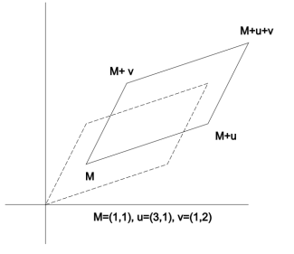

# Lecture 12 - Integrals on $\mathbb{R}²$

### 4.2 Integrating continuous maps on compact sets of $\mathbb{R}²$
---
#### 4.2.1 On rectangles

- **Prop 4.2.1:** $I$ and $J$ two compact intervals of $\mathbb{R}$. $f : I\times J \xrightarrow{} \mathbb{C}$ confinuous. The maps $y \mapsto \int_{I}f(x,y)dx$ and $x \mapsto \int_I f(x,y)dy$ are continuous on $J$ and $I$. Furthermore,
$$\int_I(\int_I f(x,y)dy)dx = \int_I(\int_I f(x,y)dx)dy $$

- **Def 4.2.1:** $I$ and $J$ two compact intervals of $\mathbb{R}$. $f$ continuous on $I\times J$. We define
 
$$\int_{I\times J}f(x,y)dxdy = \int_I dx \int_J dy f(x,y)$$

---
#### 4.2.2 On a domain defined by 2 continuous maps

- **Prop 4.2.2:** $I$ compact interval of $\mathbb{R}$. $f$ and $g$ two continuous maps on $I$ s.t $f \le g$  and let 
$$\Omega = \{(x,y) | x \in I \text{ and } f(x) \le y \le g(x)\}$$
Let $\varphi$ a continuous function on $\Omega$. The map
$$x \mapsto \int_{f(x)}^{g(x)} \varphi(x, y) d y$$
is continuous on $I$.
---
#### 4.2.3 On parallelograms
- Let $\Omega$ be a parallelogram. It is defined by a point $M = (a,b)$ and $u,v \in \mathbb{R}²$. We then have that 
$$M_1 = M + u \\ M_2 = M + u + v \\ M_3 = M + v$$

- **Def 4.2.3:** Let $\Omega$ be a parallelogram and $L$ an affine map s.t. $\Omega = L([0,1]²)$. Lef $f$ a continuous map on $\Omega$. We define
$$\int_\Omega f(x,y)dxdy = \int_{[0,1]^2} |\det L|f(L(t,s))dtdst$$
where det $L$ is the determinant of the linear map underlying $L$.
>An affine map is a function of the form $f(x) = Ax + b$, where $A$ is a matrix and $b$ is a vector. $L$ maps the unit square $[0,1]²$ onto the parallelogram $\Omega$.
---

#### 4.2.4 On domains that are $C¹$ diffeomorphic to a rectangle

- **Def 4.2.4 - diffeomophism:** Let $\Omega$ open set of $\mathbb{R}²$. Let $\varphi : \Omega \mapsto \mathbb{R}²$. We say $\varphi$ is a $C¹$ diffeomorphism  if:
  1. $\varphi$ is $C¹$
  2. $\varphi$ is bijective
  3. $\varphi$ has a $C¹$ inverse
 

- **Remark 4.2.3:** The differential of $\varphi$ is always invertible

 

- **Def 4.2.5 - Jacobian of $\varphi$:** The absolute value of the determinant of the Jacobian matrix of $\varphi$. We call it $jac(\varphi)$

 

- **Def 4.2.6 - diffeomophic to a rectangle:** We say $\Omega \subseteq \mathbb{R}²$ is $C^1$ diffeomorphic to a rectangle if $\exists$ a $C¹$ diffeomorphism $\varphi$ and a rectangle $I \times J$ s.t $\Omega = \varphi(I\times J)$

 

- **Def 4.2.7:** We set
$$\int_\Omega f(x,y)dxdy = \int_{I \times J} f \circ \varphi(t,s)jac(\varphi)(t,s)dtds$$

- **Def 4.2.8:** Let $(\Omega_k)_k$ be a finite family of domains $C^1$ diffeomorphic to a rectangle. Assume that  $\forall j \neq k$,
$$|\Omega_k \cap \Omega_j| = 0$$
Let $f$ be a continuous map on $\Omega = \cup \Omega_k$. We define
$$\int_\Omega f(x,y)\,dx\,dy = \sum\limits_k \int_{\Omega_k} f(x,y)\,dx\,dy$$
