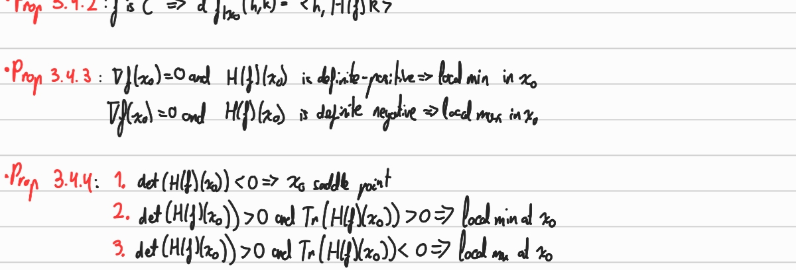

### Previous
- We have that $\int f \le \int g$ with $\int g$ convergent. Then, $\int f$ covergent.

- **Theo 1.102 - refined comparison of nonegatives:**  $f,g:I\rightarrow \mathbb{R}_+$
    1. Assume $f=O(g(x))$ when $x\xrightarrow[\lt]{} b$. Then
        $g$ integrable at $b \implies$ $f$ integrable at $b$.
    2. Assume $f(x)\sim g(x)$ when $x\xrightarrow[\lt]{} b$
        $g$ integrable at $b\iff$ $f$ integrable at $b$

---

### Lecture 11
- **Theo 4.1.1 - Dominated convergence theorem (DCT):** $I$ interval of $\mathbb{R}$. Let $(f_n)_n$ a sequence of piecewise continuous maps from $I$ to $\mathbb{C}$ and $f$ a piecewise continuous from $I$ to $\mathbb{C}$. Assume:
    1. $\forall t\in I, (f_n(t))_n$ converges towards $f(t)$.
    2. $\exists \varphi$ integrable on $I:\forall n\in \mathbb{N}$ and $t\in I, |f_n(t)|\le \varphi(t)$
then, we have:
$$\int f_n(t)dt\xrightarrow{n\rightarrow\infty} \int f(t)dt$$

### Lecture 12
- **Prop 4.1.3:** $I$ and $J$ two intervals of $\mathbb{R}$. $f:I\times J\rightarrow \mathbb{C}$. Let $x_0 \in I$ Assume:
    1. $\forall x\in I, t\mapsto f(x,t)$ piecewise continuous.
    2. $\forall t\in J, x\mapsto f(x,t)$ continuous on $x_0$.
    3. $\exists \varphi$ integrable on $J$ and $V$ a nieghborhood of $x_0:\forall x \in V, \forall t\in J, |f(x,t)|\le\varphi(t)$  
    Then, 
$$g(x)=\int_{I}f(x,t) dt$$
is well-defined and continuous at $x_0$.
    

### TD13
- **Theo 4.3.1 - Jacobian change of variable:** 
$$\int_{\varphi(\Omega)} f(x,y)dxdy = \int_{\Omega} f(\varphi(z,t))jac(\varphi(z,t))dzdt$$

- **Def 4.2.4 - Diffeomorphism:** $\Omega$ an open set of $\mathbb{R}^2$. Let $\varphi:\Omega\rightarrow \mathbb{R}^2$. We say $\varphi$ is a $C^1$ diffeomorphism if:
1. $\varphi$ is $C¹$
2. is a bijeciton from $\Omega$ to $\varphi(\Omega)$
3. Its inverse is $C¹$

### EXTRA

- **Cauchy-Schwartz inequality:** $\left|\langle \mathbf {u} ,\mathbf {v} \rangle \right|^{2}\leq \langle \mathbf {u} ,\mathbf {u} \rangle \cdot \langle \mathbf {v} ,\mathbf {v} \rangle $

##### Euler's form
$$\sin x=\frac{e^{ix}-e^{-ix}}{2i}$$
$$\cos x=\frac{e^{ix}+e^{-ix}}{2i}$$

##### Classical series expansion
1. For $|x|<1$, 
$$\frac{1}{1-x}=\sum_{k=0}^\infty x^k$$

2. For $x\in\mathbb{C}$, 
$$e^x=\sum_{k=0}^\infty \frac{x^k}{k!}$$

3. For $|x|<1$, 
$$-\ln(1-x)=\sum_{k=1}^\infty \frac{x^k}{k}$$

4. for $x\in\mathbb{R}$
$$\cos x=\sum_{k=0}^\infty (-1)^k\frac{x^{2k}}{(2k)!}, \ \ \sin x = \sum_{k=0}^\infty (-1)^k \frac{x^{2k+1}}{(2k+1)!}$$

##### Classic Integrals
1. $$\int_{0}^x \frac{1}{1+t²}dt = \arctan x$$
2. $$\int_{1}^x \ln t dt = x\ln x -x +1$$